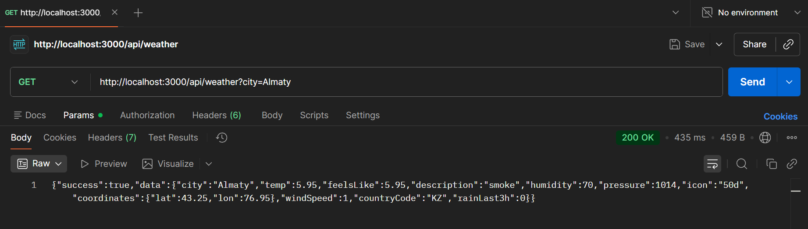
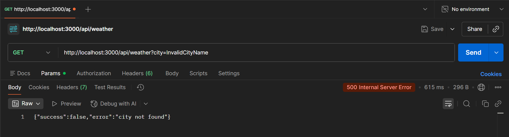
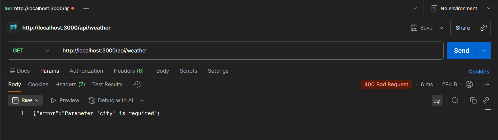
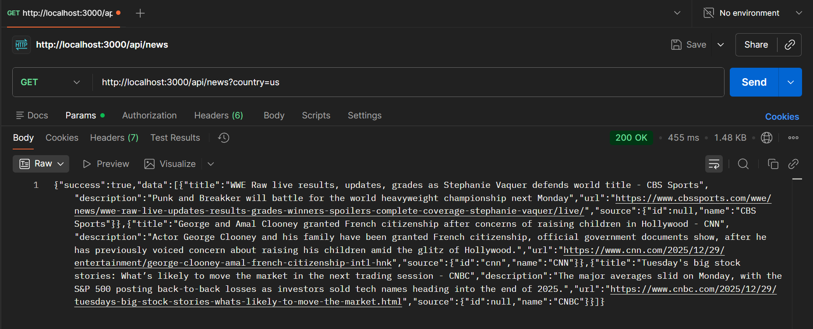
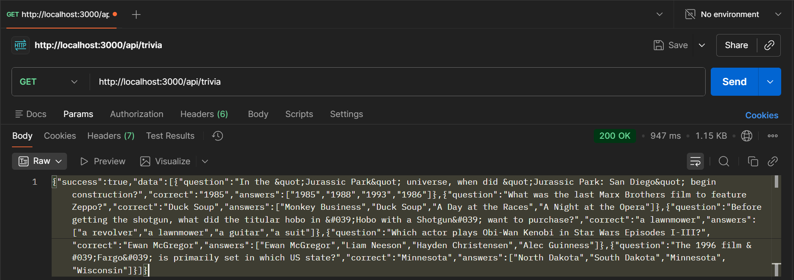

//////////////////////////
// Tamerlan Yessimov    //
// Astana IT University //
// Group: SE-2420       //
//////////////////////////

Mini-app that shows weather and geolocation using official API's written on Node JS.
API testing using Postman:

